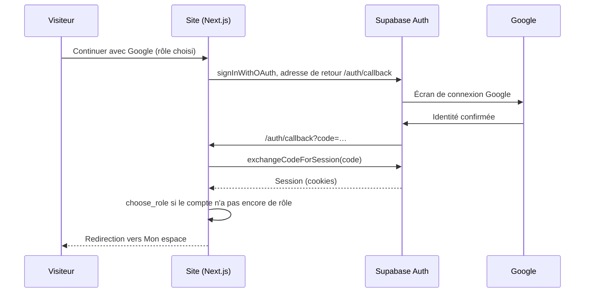

# Authentification LSES Fighting

L'authentification repose sur Supabase Auth. Le site ne manipule jamais de mot de passe lui-même : il transmet les formulaires à Supabase depuis le serveur (actions serveur de Next.js), puis garde la session dans des cookies que le proxy renouvelle à chaque requête.

## Parcours

**Inscription par e-mail.** La personne choisit « athlète » ou « coach », saisit son adresse et un mot de passe d'au moins 10 caractères, et accepte la publication de son profil. Le rôle et la langue accompagnent la demande ; la base crée aussitôt le compte applicatif et la fiche vide du bon type. Supabase envoie un lien de confirmation. En l'ouvrant, la personne arrive dans « Mon espace », connectée.

**Google.** Le bouton envoie vers Google en passant par Supabase, puis revient sur `/auth/callback`, qui échange le code reçu contre une session (flux PKCE). Si l'inscription part de la page « Rejoindre », le rôle choisi est appliqué au retour. Si le compte est nouveau et qu'aucun rôle n'est connu, la page « Bienvenue » demande de choisir, une fois pour toutes.

**Mot de passe oublié.** Le lien reçu par e-mail ouvre une session temporaire sur `/auth/confirm`, puis mène à la page « Nouveau mot de passe ».

## Mesures de sécurité

**Validation côté serveur.** Chaque formulaire est revérifié sur le serveur (bibliothèque Zod) avant tout appel à Supabase, quelle que soit la page qui l'envoie. Les actions serveur de Next.js refusent les requêtes venant d'une autre origine, ce qui protège contre la falsification de requêtes (CSRF).

**Pas de fuite d'information sur les comptes.** L'inscription, la connexion et le mot de passe oublié répondent de la même façon qu'une adresse soit connue ou non. On ne peut donc pas s'en servir pour savoir qui est inscrit.

**Redirections maîtrisées.** L'adresse de retour après connexion (`next`) n'est acceptée que si c'est un chemin interne du site, préfixé par une langue. Un lien piégé vers un site extérieur est ignoré. Les adresses envoyées à Supabase et à Google sont construites à partir de la configuration (`NEXT_PUBLIC_SITE_URL`), jamais à partir des en-têtes de la requête, et Supabase n'accepte que celles déclarées dans ses Redirect URLs.

**Identité vérifiée à chaque page protégée.** « Mon espace » et ses sous-pages contrôlent la session sur le serveur avec `getClaims()`, qui vérifie la signature du jeton. L'en-tête qui affiche « Mon espace » ou « Connexion » n'est qu'un affichage : il ne donne accès à rien.

**Rôle impossible à usurper.** Le rôle transmis à l'inscription n'est lu qu'une fois, par la base, qui n'accepte que « athlète » ou « coach ». Le rôle de superviseur ne s'obtient que par un script SQL exécuté par l'équipe technique, et cette promotion est inscrite au journal d'audit.

**Liens d'e-mail robustes.** Les modèles d'e-mails du projet utilisent un jeton à usage unique (`token_hash`) vérifié par `/auth/confirm`. Le lien fonctionne même s'il est ouvert sur un autre appareil que celui de l'inscription, et un lien déjà utilisé ou expiré renvoie vers la page de connexion avec un message clair.

## Tester

Sans configuration SMTP, Supabase n'envoie les e-mails qu'aux membres de l'équipe du projet. Pour un essai complet, on inscrit une adresse membre de l'équipe, puis on vérifie dans l'ordre : l'inscription et le lien de confirmation, la connexion et la déconnexion, la connexion Google depuis « Rejoindre » (rôle appliqué) et depuis « Connexion » (page « Bienvenue »), le mot de passe oublié, et enfin l'accès direct à `/fr/mon-espace` après déconnexion, qui doit renvoyer vers la connexion.
