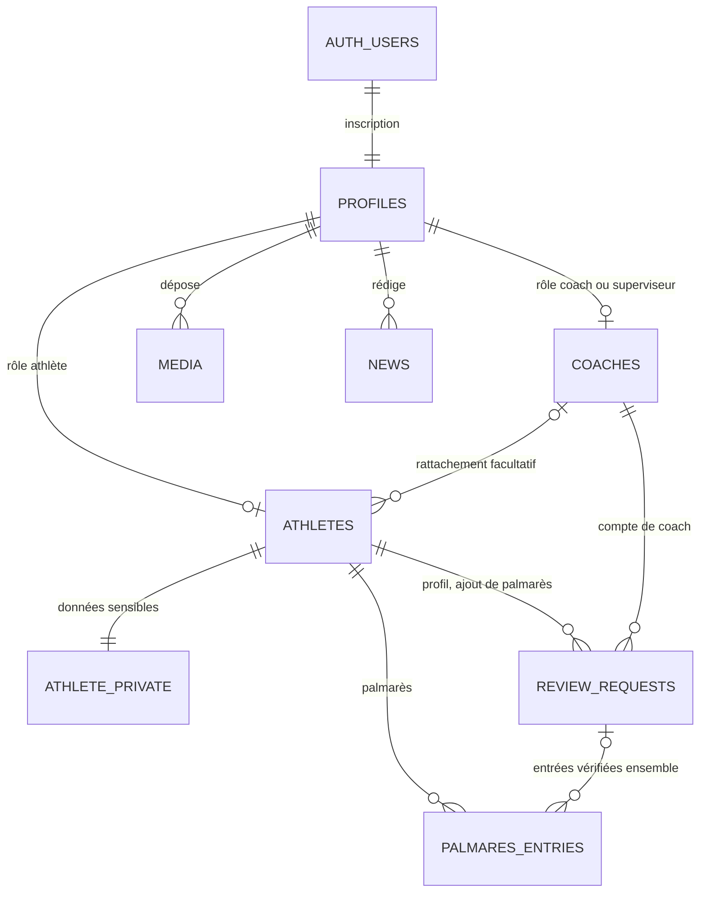
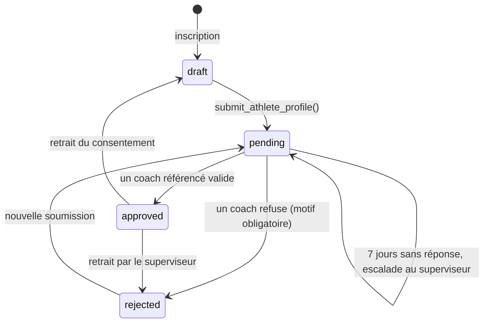

# Base de données LSES Fighting

La base repose sur PostgreSQL, hébergé par Supabase. Elle est décrite entièrement par cinq migrations SQL (`supabase/migrations`), ce qui permet de la reconstruire à l'identique et de suivre chaque évolution dans Git.

| Migration                       | Contenu                                                               |
| ------------------------------- | --------------------------------------------------------------------- |
| `…100000_schema_de_base`        | Types, tables, index                                                  |
| `…100100_regles_acces`          | Privilèges, sécurité au niveau des lignes (RLS), contrôles d'écriture |
| `…100200_circuit_de_validation` | Inscription, soumission, décisions, escalade automatique au 7e jour   |
| `…100300_stockage`              | Buckets de fichiers et leurs règles d'accès                           |
| `…23100000_recherche_publique`  | Recherche sans accents dans les répertoires publics                   |

## Modèle de données

`profiles` porte le rôle de chaque compte : athlète, coach ou superviseur général. Le superviseur peut aussi avoir une fiche de coach, ce qui est le cas du client. `athletes` et `coaches` ne contiennent que des informations publiables. La date de naissance et l'attestation parentale sont isolées dans `athlete_private`, qu'aucun visiteur ne peut lire. `review_requests` forme la file d'attente des vérifications, `palmares_entries` le palmarès structuré (compétition, année, lieu, catégorie, résultat). `media` et `news` alimentent les pages disciplines et les actualités. `audit_log` garde la trace de toutes les décisions.

## Circuit de validation

Une fiche d'athlète soumise est visible par **tous** les coachs référencés, et n'importe lequel peut la valider. Sans décision au septième jour, une tâche planifiée (pg_cron, toutes les heures) la fait passer au superviseur général : les coachs ne peuvent alors plus trancher. Pour un athlète mineur (moins de 18 ans), la validation reste bloquée tant que le coach n'a pas attesté avoir reçu l'autorisation écrite d'un responsable légal. Le document lui-même n'est pas stocké.

Une fois la fiche en ligne, l'athlète peut encore modifier sa présentation, sa ville, sa catégorie ou sa photo. La fiche reste visible, et son coach la voit « modifiée, à revoir ». Le nom, les prénoms, le sexe, la discipline et la date de naissance sont en revanche verrouillés. Chaque nouvelle entrée de palmarès ouvre une demande de vérification et reste invisible du public jusqu'à la décision d'un coach.

Les comptes de coach sont validés par le superviseur général uniquement, puisqu'un coach référencé obtient le pouvoir de publier des fiches, mineurs compris.

## Fonctions appelées depuis le site

Toutes s'appellent avec `supabase.rpc(nom, paramètres)` par un utilisateur connecté.

- `choose_role(p_role)` : choix du rôle athlète ou coach après une inscription Google.
- `submit_athlete_profile()` et `submit_coach_profile()` : soumission d'une fiche complète.
- `review_athlete_profile(p_request_id, p_approve, p_reason, p_guardian_attested, p_rejected_entry_ids)` : décision sur une fiche d'athlète.
- `review_palmares(p_request_id, p_approve, p_reason, p_rejected_entry_ids)` : décision sur un ajout de palmarès.
- `review_coach_account(p_request_id, p_approve, p_reason)` : décision du superviseur sur un compte de coach.
- `mark_athlete_reviewed(p_athlete_id)` : le coach confirme avoir relu une fiche modifiée.
- `withdraw_profile(p_profile_id, p_reason)` : retrait d'une fiche par le superviseur.
- `pending_athlete_ages()` : âge des athlètes en attente, sans révéler leur date de naissance.

Deux fonctions de recherche sont en plus ouvertes aux visiteurs : `search_athletes(p_query)` et `search_coaches(p_query)`. Elles renvoient les fiches en ligne dont le nom, les prénoms, la ville (et le dojo pour un coach) contiennent chacun des mots saisis, sans tenir compte des accents ni des majuscules. Elles s'exécutent avec les droits de l'appelant, donc sous la RLS, et le site y ajoute ses filtres et sa pagination.

## Mesures de sécurité

**Moindre privilège.** Supabase accorde par défaut tous les droits sur les tables aux visiteurs et aux comptes connectés. Nous les retirons, puis nous ne rendons que la lecture et, pour les écritures, une liste fermée de colonnes. Le statut d'une fiche, son adresse publique ou les champs de vérification ne sont donc modifiables par aucun utilisateur, même sur sa propre fiche.

**Sécurité au niveau des lignes.** Chaque table active la RLS, avec une seule règle par action et par rôle. Un visiteur ne voit que les fiches en ligne et les entrées de palmarès vérifiées. Un athlète voit sa fiche. Un coach référencé voit en plus la file d'attente. Le superviseur voit tout.

**Changements d'état contrôlés.** Soumettre, valider, refuser ou retirer une fiche passe obligatoirement par une fonction SQL qui vérifie l'identité et le rôle de l'appelant, applique la règle métier et écrit le journal dans la même transaction. Ces fonctions ont un `search_path` vide, pour empêcher tout détournement par un objet homonyme.

**Journal d'audit infalsifiable.** Aucune ligne ne peut être modifiée ni supprimée, y compris par le superviseur, la clé de service ou l'administrateur de la base : un déclencheur bloque toute tentative. Les promotions au rôle de superviseur y sont inscrites automatiquement, même lorsqu'elles sont faites en console.

**Données personnelles.** La date de naissance n'est jamais publiée. Les coachs voient l'âge des athlètes en attente, pas leur date de naissance. Le retrait du consentement de publication retire immédiatement la fiche du site. L'horodatage du consentement est fixé par le serveur.

**Fichiers.** Les photos de profil sont dans un bucket privé : une photo ne devient lisible par le public que si elle est déclarée sur une fiche en ligne, et chacun ne peut déposer que dans son propre dossier. Les vidéos externes sont limitées à YouTube et Facebook.

## Réglages métier

Deux valeurs se modifient en une ligne, par une nouvelle migration : l'âge de la majorité, fixé à 18 ans (`private.majority_age()`), et le délai avant escalade, fixé à 7 jours (`private.review_delay()`).

## Vérification

`supabase/tests/scenarios_securite.sql` rejoue 79 scénarios, autorisés et interdits (élévation de privilèges, lecture de données sensibles, contournement du circuit, falsification du journal, dépôt de fichiers chez autrui…), puis annule toutes ses écritures. Il s'exécute dans le SQL Editor de Supabase ou avec psql.
